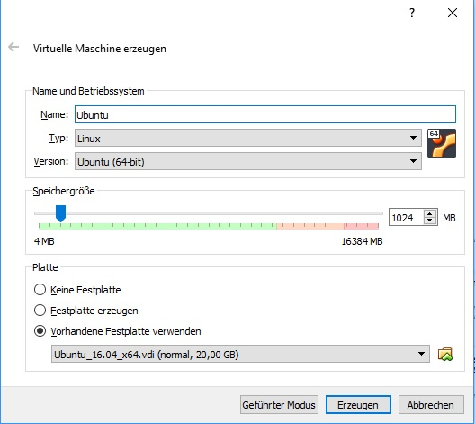
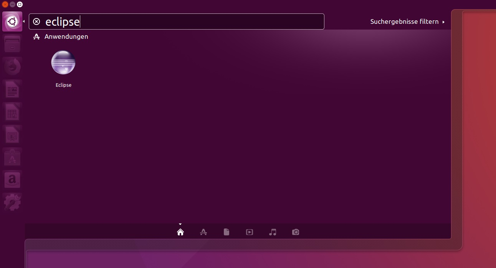
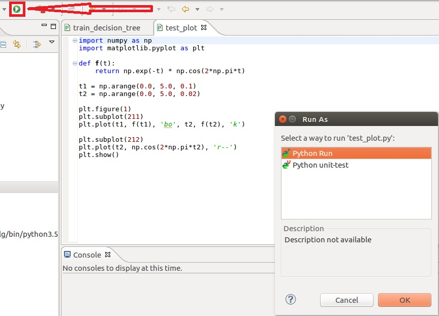

# MetaMarathon

## Requirements

* [VirtualBox](https://www.virtualbox.org/wiki/Downloads)
* At least 15 Gb free disk space

## Setup

### Install VirtualBox

* Follow install instructions of [VirtualBox](https://www.virtualbox.org/wiki/Downloads)

### Download Image

* Downloaded .vdi-file from [nextcloud](https://nextcloud.mirevi.medien.hs-duesseldorf.de/index.php/s/OvNqimOvcumJWWa)

### Import Image

* Click **New-Button**
* Type an appropriate name for the image
* Choose **Type Linux** and **Version Ubuntu (64 Bit)**
* If you are not able to choose 64 bit: 
	** Ensure [Hyper-V](https://www.poweronplatforms.com/enable-disable-hyper-v-windows-10-8/) is disabled
	** Ensure [Hardware virtualization is enabled in the BIOS](https://superuser.com/questions/866962/why-does-virtualbox-only-have-32-bit-option-no-64-bit-option-on-windows-7?utm_medium=organic&utm_source=google_rich_qa&utm_campaign=google_rich_qa)
* Choose **Use an existing virtual hard drive file**
* Click on the folder button and browse for the .vdi file which you downloaded in the previous step
* Click **Create**

### Start the Image

* Double-Click on image created in previous step
* If error occur: make sure [Hyper-V](https://www.poweronplatforms.com/enable-disable-hyper-v-windows-10-8/) is disabled
* Login as **modalg** with password **12345678**

### Start Eclipse

* Click on **Ubuntu-Button** and search for **eclipse**
* Execute eclipse
* Click **ok** when **workspace dialog** appears

### Run Test Project

* Open **test** folder in **modalg181-Project**
* Double click on any of the files
* Execute file with click on **run** button (**run as Python Run**)
