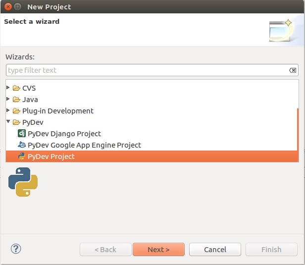
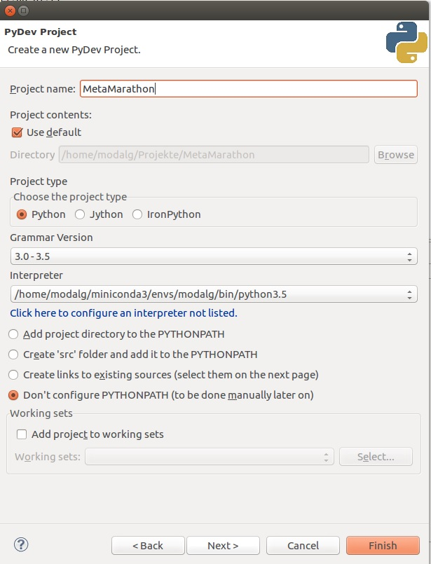

# MetaMarathon

## Task

Clone the repository and switch to one of the branches named easy, medium and hard. Fill in the gaps which are marked with **TODO**. Execute script dqn/src/main.py. All scripts can include TODOs. After finishing development, you can download pretrained weights from the Nextcloud-folder and see the agent play. You switch between training and playing process by changing the **train**-Flag. The slides can be downloaded as pdf from the [Nextcloud](https://nextcloud.mirevi.medien.hs-duesseldorf.de/index.php/s/LPlGOaw87G9iQa8)(filename: "Build your own Hero.pdf")
 
### Aim

Develop an AI which is able to play Atari games. Reinforement Learning with Deep Q Networks is used to train an autonomous agent. 

## Requirements

* [VirtualBox](https://www.virtualbox.org/wiki/Downloads)
* At least 15 Gb free disk space

## Setup

### Install VirtualBox

* Follow install instructions of [VirtualBox](https://www.virtualbox.org/wiki/Downloads)

### Download Image

* Downloaded .vdi-file from [nextcloud](https://nextcloud.mirevi.medien.hs-duesseldorf.de/index.php/s/OvNqimOvcumJWWa)

### Import Image

* Click **New-Button**
* Type an appropriate name for the image
* Choose **Type Linux** and **Version Ubuntu (64 Bit)**
* If you are not able to choose 64 bit: 
	* Ensure [Hyper-V](https://www.poweronplatforms.com/enable-disable-hyper-v-windows-10-8/) is disabled
	* Ensure [Hardware virtualization is enabled in the BIOS](https://superuser.com/questions/866962/why-does-virtualbox-only-have-32-bit-option-no-64-bit-option-on-windows-7?utm_medium=organic&utm_source=google_rich_qa&utm_campaign=google_rich_qa)
* Choose **Use an existing virtual hard drive file**
* Click on the folder button and browse for the .vdi file which you downloaded in the previous step
* Click **Create**

### Start the Image

* Double-Click on image created in previous step
* If error occur: make sure [Hyper-V](https://www.poweronplatforms.com/enable-disable-hyper-v-windows-10-8/) is disabled
* Login as **modalg** with password **12345678**

### Start Eclipse

* Click on **Ubuntu-Button** and search for **eclipse**
* Execute eclipse
* Click **ok** when **workspace dialog** appears

### Run Test Project

* Open **test** folder in **modalg181-Project**
* Double click on any of the files
* Execute file with click on **run** button (**run as Python Run**)

### Clone this repository and setup eclipse

* Open explorer
* Navigate to folder **Projekte**
* Right click in explorer and select **Open in terminal** option
* Type **git clone https://github.com/mati3230/MetaMarathon.git** in terminal
* If closed, start eclipse 
* Right click in **PyDev Package Explorer**
* Select **New/Project...** option

* Select **PyDev/PyDev Project** and click **Next**

* Type project name **MetaMarathon**
* Select grammar version **3.0-3.5**
* Select interpreter **/home/modalg/miniconda3/envs/modalg/bin/python3.5**
* Press **Finish**

## Work with the repository

### Clone the repository

* Open explorer
* Navigate to folder **Projekte**
* Right click in explorer and select **Open in terminal** option
* Type **git clone https://github.com/mati3230/MetaMarathon.git** in terminal

### Update to latest state

* Open explorer
* Navigate to folder **Projekte**
* Right click in explorer and select **Open in terminal** option
* Type **git pull origin master** in terminal

### Switch to branch with certain **level of difficulty**

* Open explorer
* Navigate to folder **Projekte**
* Right click in explorer and select **Open in terminal** option
* There are the the branches **easy**, **medium** and **hard**. Type **git checkout easy** in terminal to switch to **easy**-branch. Type **git checkout medium** in terminal to switch to **medium**-branch
* If closed, start eclipse 
* Left click on the project **MetaMarathon** you created before in step **Clone this repository and setup eclipse** and press **F5** to refresh the project. Now you should see a **dqn** folder. 

## Work with Python and the Frameworks

### Python

* [Python Cheat-Sheets](https://ehmatthes.github.io/pcc/cheatsheets/README.html)
* [Python Beginner Tutorials](https://wiki.python.org/moin/BeginnersGuide/Programmers)

### OpenAI

* [Basic OpenAI Tutorial](https://gym.openai.com/docs/)

### Tensorflow

* [Getting Started With TensorFlow](https://www.tensorflow.org/versions/r1.1/get_started/get_started)
* [Advanced TensorFlow Tutorials](https://www.tensorflow.org/tutorials/)
* [Tensorflow 1.5 Documentation](https://www.tensorflow.org/versions/r1.5/api_docs/)

## Pretrained Model

* You can download pretrained weights of the model [here](https://nextcloud.mirevi.medien.hs-duesseldorf.de/index.php/s/LPlGOaw87G9iQa8)
* Place the files to /dqn/src/experiments/Breakout-v0/checkpoints
